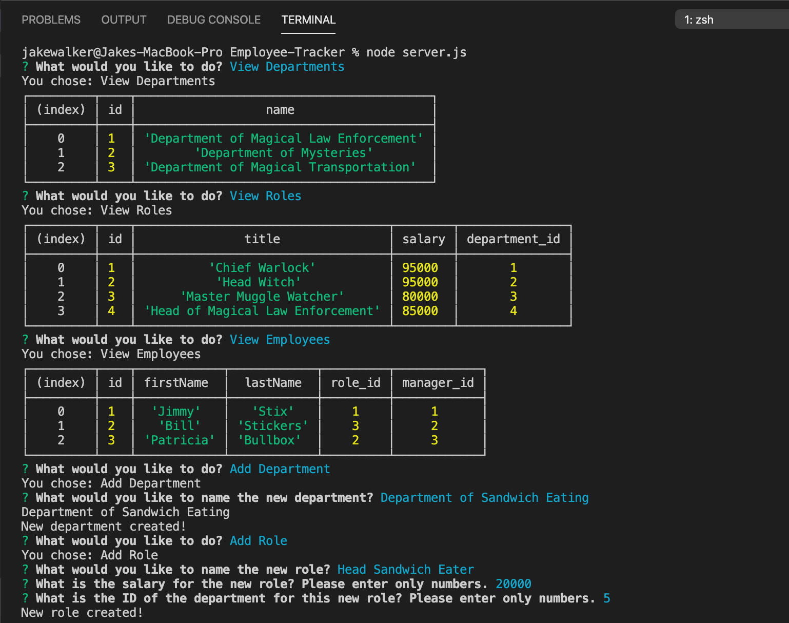

# Employee-Tracker
Employee Tracker

The purpose of this project was to build a command line interface application that allows the user: to view employees, roles, and departments; to add employees, roles, and departments; and update employee roles. The project user story is below.

```
AS A business owner

I WANT to be able to view and manage the departments, roles, and employees in my company

SO THAT I can organize and plan my business
```

 The criteria for a successful project are below: 

* Application should allow users to view employees, roles, and departments.

* Application should allow users to add employees, roles, and departments. 

* Application should allow users to update employee roles. 

## Getting Started

The deployed project should look like this. Click the image to see a video of the deployed project.

[](https://youtu.be/gHqO3q2FgWc)


Below is the link to the project repository followed by a link to the video of how the application works. 

https://github.com/jcw2865/Employee-Tracker

https://youtu.be/gHqO3q2FgWc

### Development

Below are the steps I took to create the application as it is so far. The most difficult aspect of this application for me was finding the correct syntax to use to speak to the MySQL database. This was my first time using MySQL, so trying to push and pull data took a lot of trial and error.

1. Created the initial files (server.js and seeds.sql). 

2. Downloaded all dependecies using npm. 

3. Created one large asynchronous function that housed the rest of the functions.

4. Created const's for all sets of inquirer prompts. 

5. Paired the above const's with functions that took in their responses and used them in the MySQL database. 

## Testing

This application was not developed using Test Driven Development. However, at numerous points throughout development, console.log's and console.table's were used to test the results of new elements. This was especially useful given how new SQL syntax is for me. 

## Deployment

This program can be viewed and deployed using most internet browsers via the links in the "Getting Started" section. 

## Built With

* [VSCode](https://code.visualstudio.com/) - The platform I used for developing this project.
* [MDN](https://developer.mozilla.org/en-US/) - Used as a reference tool.
* [MySQL](https://www.mysql.com/) - Used as a database management tool. 
* [Node.js](https://nodejs.org/en/) - Used to execute JS code outside of a web browser.
* [NodePackageManager](https://www.npmjs.com/) - Used to install node modules/dependencies
* [Inquirer](https://www.npmjs.com/package/inquirer) - A collection of common interactive command line user interfaces.
* [YouTube](https://youtube.com) - Used to publish the video of the CLI which can be found in the "Getting Started" section.
<!-- * [GoogleChrome](https://www.google.com/chrome/) - Used for inspector tool and validating the program during development.  -->
<!-- * [Postman](https://www.getpostman.com/) - A collaboration platform for API development. -->
<!-- ## Contributing

Please read [CONTRIBUTING.md](https://gist.github.com/PurpleBooth/b24679402957c63ec426) for details on our code of conduct, and the process for submitting pull requests to us. -->

## Authors

* **Jake Walker** - [jcw2865](https://github.com/jcw2865)

<!-- See also the list of [contributors](https://github.com/your/project/contributors) who participated in this project. -->

<!-- ## License

This project is licensed under the MIT License - see the [LICENSE.md](LICENSE.md) file for details -->

## Acknowledgments

* The advisors, instructors, and TAs at the Trilogy Coding Bootcamp at the University of Texas at Austin
* Tutoring staff at Trilogy
* Fellow classmates at the Coding Bootcamp at UT-Austin
* Friends in the industry